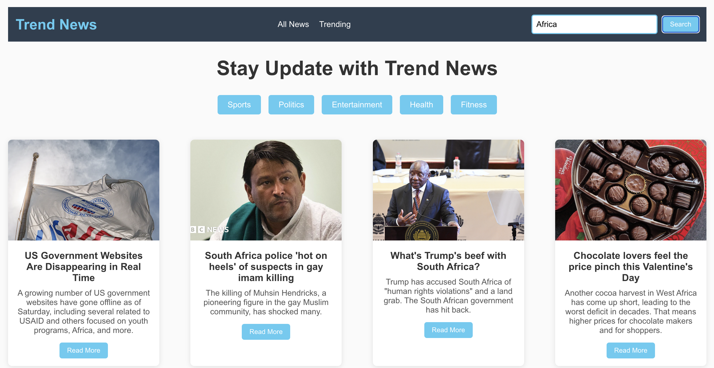
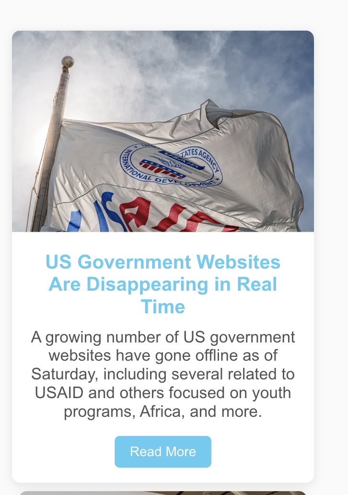
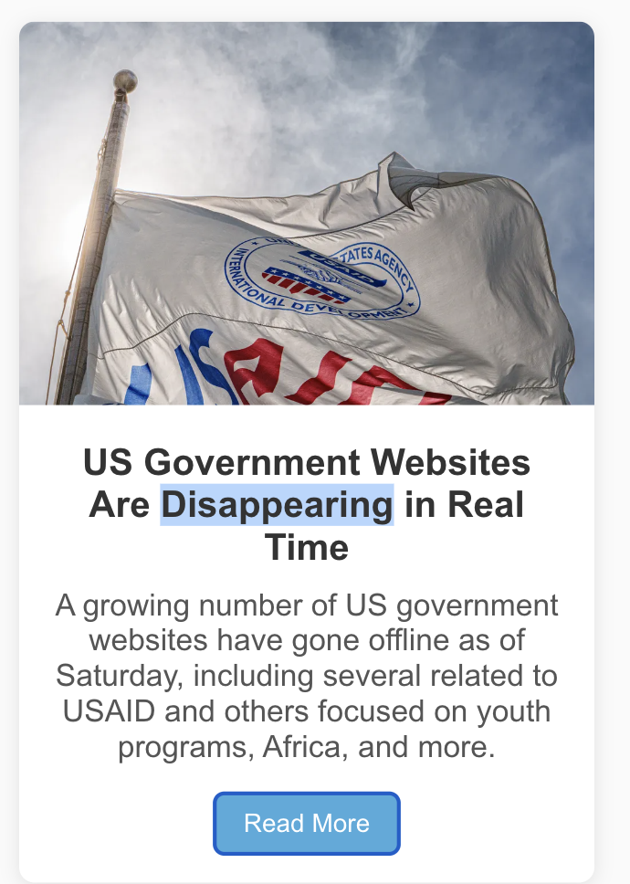
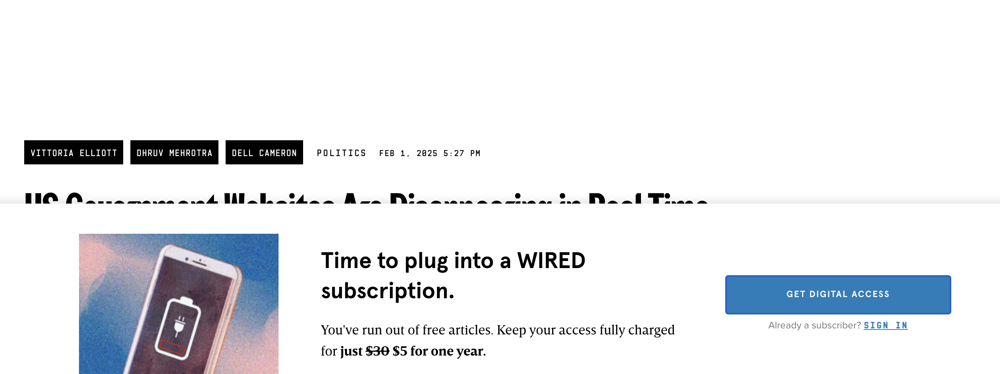
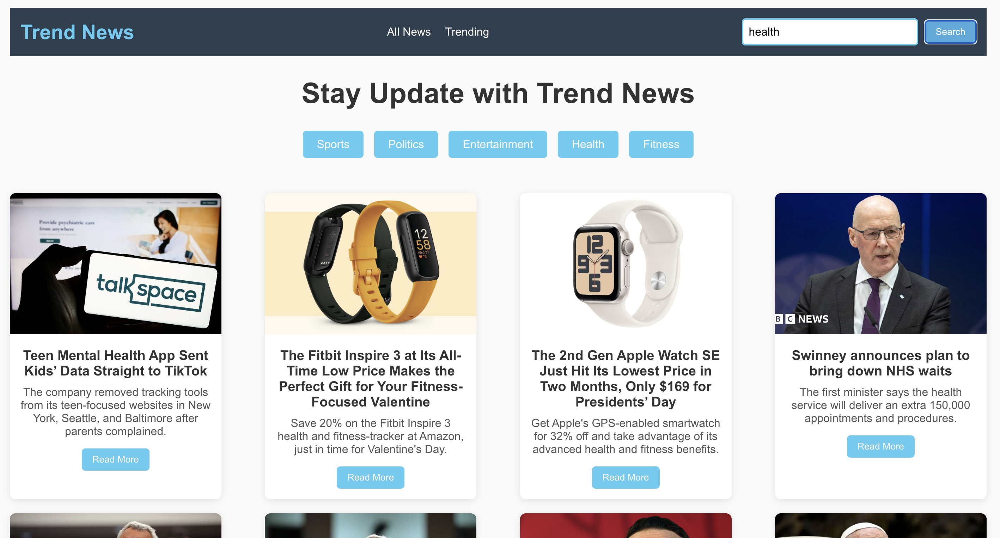
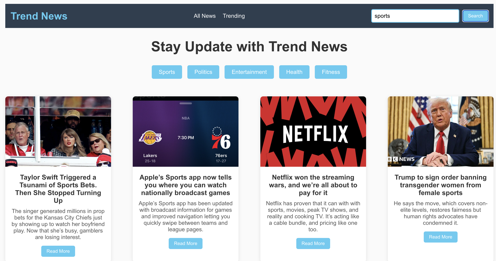
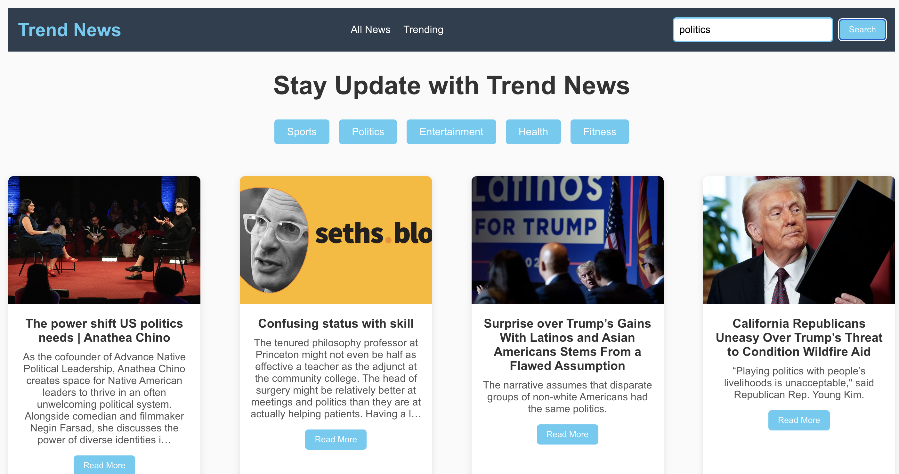

# Trend News App

Welcome to the **Trend News App**, a web application where you can stay up-to-date with the latest news in various categories. Whether you're interested in **sports**, **politics**, **entertainment**, **health**, or **fitness**, this app provides you with real-time news articles fetched from an API. You can easily search for news topics and click "Read More" to get the full article.

## Features

- **Search Bar**: Allows users to search for any topic of interest.
- **Category Buttons**: Easily navigate through trending news categories like Sports, Politics, Entertainment, Health, and Fitness.
- **Trending News**: Get the latest news articles in real-time.
- **Read More**: Click on "Read More" to view the full article in your browser.
  
## Technologies Used

- **React**: Front-end JavaScript library used to build the app’s user interface.
- **NewsAPI**: The app fetches news articles from [NewsAPI](https://newsapi.org/).
- **CSS**: For styling the app and making it visually appealing.
  
## Installation

To set up and run this project locally, follow the steps below:

1. **Clone the repository**:
   ```bash
   git clone https://github.com/EMMMABK/NewsApi.git
   ```
   
2. **Navigate to the project directory**:
   ```bash
   cd newsapi
   ```
   
3. **Install the required dependencies**:
   ```bash
   npm install
   ```
   
4. **Create an API Key**:
   - Go to [NewsAPI](https://newsapi.org/), create an account and generate an API key.
   
5. **Set up your API key**:
   - Replace `API` in the `API_KEY` variable inside `Newsapp.jsx` with the API key you received from NewsAPI.

6. **Run the application**:
   ```bash
   npm start
   ```

7. **Open your browser**:
   - Visit `http://localhost:3000` to see the app in action!

## How to Use

1. **Search for News**: 
   - Simply type a keyword (e.g., “USA”, “politics”) into the search bar and hit "Search" to find the latest news articles related to that keyword.

2. **Select a Category**:
   - Click on any of the category buttons like **Sports**, **Politics**, **Entertainment**, **Health**, or **Fitness** to view the latest news in those categories.

3. **Read More**:
   - Click on the "Read More" button in each news card to open the full article in your browser.

## App Structure

- `App.js`: Main entry point that contains the `Newsapp` component.
- `Card.jsx`: Component for displaying each news article in a card format.
- `styles.css`: Custom CSS file for styling the app.
- `Newsapp.jsx`: Component is the core of the application.

## Screenshots








## Example

1. **Sports News**:
   - Click on the "Sports" category to get the latest sports news.
   
2. **Search by Keyword**:
   - Type "USA" in the search bar and get news articles related to the United States.

3. **Trending News**:
   - Visit external trending news sources like [All News](https://www.allbanglanewspaper.xyz/) and [Trending News](https://apnews.com/hub/trending-news).

## Contributing

If you would like to contribute to this project, feel free to fork the repository and create a pull request with your changes. Contributions are always welcome!

## License

This project is licensed under the MIT License - see the [LICENSE](./LICENSE) file for details.
